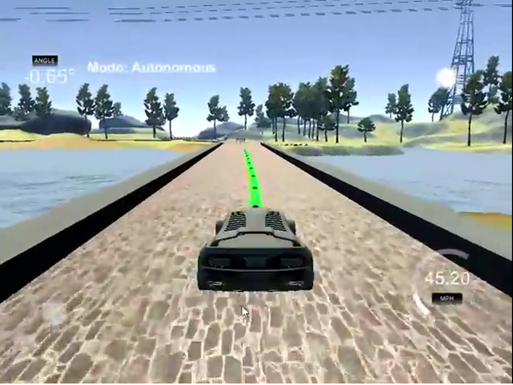

# CarND-Controls-MPC
Self-Driving Car Engineer Nanodegree Program
---

## Objective
Objective of this project is to implement a software pipeline using the model predictive control (MPC) method to drive a car around a track in a simulator. 

***Final project video of Car driving in simulator can be found [here](https://youtu.be/RqTBWU-D204)***




## MPC Model

### The State Variables
The state variables for vehicle as per MPC are as following:
* **px**: current location in x axis of global map coordinate system
* **py** : current location in y axis of global map coordinate system
* **psi**: current heading of the vehicle
* **v**: current velocity of the vehicle
* **cte**: cross track error, which is difference between our desired position and actual position
* **epsi**: difference between our desired heading and actual heading

### Actuation
* **delta**: this represents the steering angle by which we will turn our vehicle. The angle is restricted to be between -25 and 25 degrees.
* **a**: this is the throttle or brake value which represents the acceleration or de-acceleration of vehicle. The simulator expects values between -1 and 1. Negative values represents brake while positive values represent throttle.

Simulator provides us the state of vehicle with each movement and in addition it also provides series of waypoints which are points with respect to an arbitrary global map coordinate system.  These waypoints fit a polynomial which is a function that estimates the curve of the road ahead.

## KINEMATIC MODEL
```
px` = px + v * cos(psi) * dt
py` = py + v * sin(psi) ( dt)
psi` = psi + v / Lf * (-delta) * dt
v` = v + a * dt
cte` = cte - v * sin(epsi) * dt
epsi` = epsi +  v / Lf * (-delta) * dt
where Lf - Distance between center of mass and axle
```
cte and epsi are based on actuations
```
cte` = cte - v * sin(epsi) * dt
epsi` = epsi +  v / Lf * (-delta) * dt
```
## Cost Function and Penalty Weights
Our objective is to minimize the cost function so as to obtain most optimal path. Factors that affect cost are as following :-
* **Cte** (Cross track error) To remain as close as to reference trajectory
* **epsi** (heading error) To remain oriented to our desired heading.
* **v** (velocity) : We want to maintain at-least desired velocity.

Additionally:-
* We don't want to steer if we don't really need to
* We don't want to accelerate or brake if we don't really need to
* We don't want consecutive steering angles to be too different
* We don't want consecutive accelerations to be too different

So equation for cost becomes:-
```
cost = A * cte^2 + B * epsi^2 + C * (v - vref)^2 +
       D * delta^2 + E * a^2 + F * (delta` - delta)^2  +  G * (a` - a)^2
```
*here vref is the desired reference velocity*.

A-G are penalty weights that are derived by trial and error. Final wights that I tuned are:-
```
A = 1
B = 1
C = 1
D = 10
E = 10
F = 500
G = 10
```
## Timestep Length and Elapsed Duration (N & dt)
* **N**: This represents how many states we look into future.
* **dt**: This represents in how much time we expect changes in the environment
N can’t be too small else we won’t be able to take advantage of looking ahead in future to plan for curves that we might not be able to do with simpler and less sophisticated control methods like PID. We also can’t use too large value for N as future might not be as we expect it. After trial and error the values for N and dt that I reached are **N:10** and **dt:0.1** seconds.

## Polynomial Fitting and MPC Preprocessing
**Transformation to Vehicle Coordinates**: 
The waypoints provided to us are in global coordinate system so we have to convert them to vehicle coordinates. This simplifies the process as vehicle's x and y coordinates are now at the origin (0, 0) and the orientation angle is also 0.

**Polynomial fitting**
I used a 3rd order polynomial to estimate curves on road ahead because it is known to fit most of the roads. Using a smaller order can result in underfitting while using a higher order can result in overfitting.

## Model Predictive Control with Latency
As part of the project challenge, we have to take in account **100ms** latency delay. This is to mimic the real life situation where there is some delay with actual actuation commands and response. So instead of using state parameters as-is, we need to adjust latency to it. To do so, I used our kinematic model and adjusted state parameters with latency factor before passing state parameters to solver.

Here is the code for the same:-
```
double state_px = 0.0 + v * dt;
double state_py = 0.0;
double state_psi = 0.0 + v * -delta / Lf * dt;
double state_v = v + throttle * dt;
double state_cte = cte + v * sin(epsi) * dt;
double state_epsi = epsi + v * -delta / Lf * dt;

```